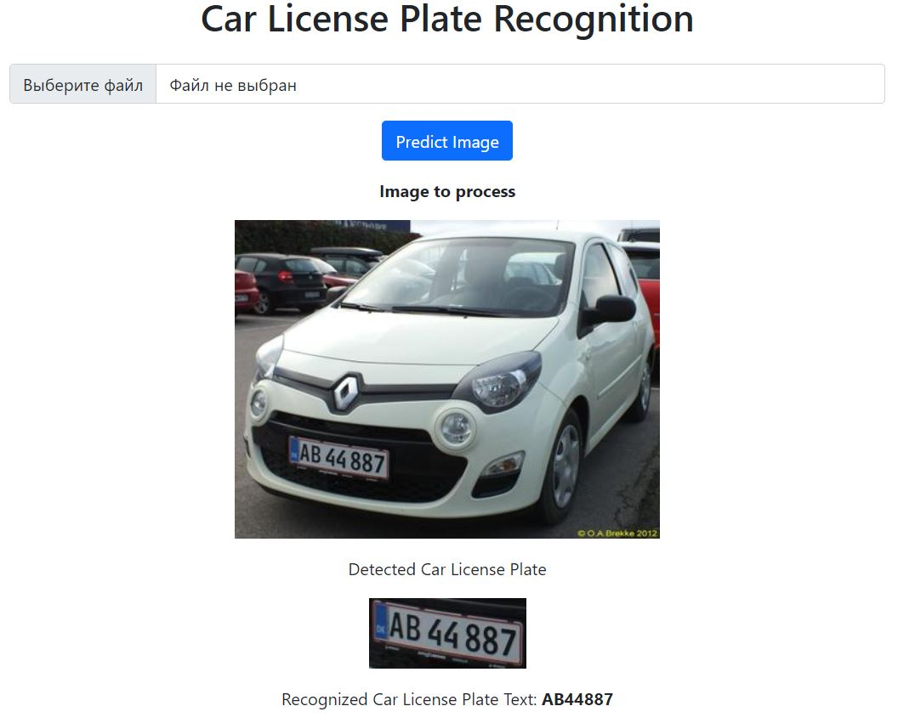

# Car License Plate Text Recognition

This repo is dedicated to car license plate detection and its text recognition.

For object detection model YOLOv8n was used. Model training procedure is implemented in Jupyter Notebook: `notebook/license_plate_detector.ipynb`.
EasyOCR module takes a detected license plate and runs OCR for character recognition.

## How to run

First of all, install all required packages from `requirements.txt`

`pip install -r requirements.txt`

Then, run an app:

`python app.py`

Here is the result of testing the service:

